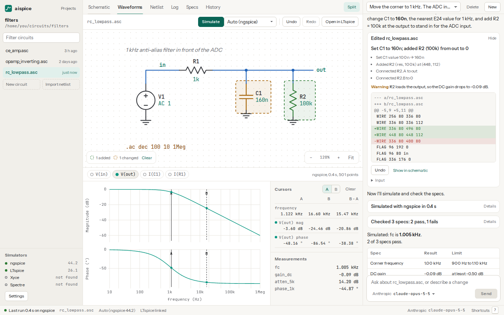

<p align="center">
  <picture>
    <source media="(prefers-color-scheme: dark)" srcset="assets/brand/lockup-dark.svg">
    
  </picture>
</p>

<p align="center">An AI agent for LTspice circuits: it edits schematics, simulates them,<br>measures the results and sizes parts until your specs pass.</p>

<p align="center">
  <a href="https://github.com/danieltyukov/aispice/actions/workflows/ci.yml"></a>
  <a href="https://github.com/danieltyukov/aispice/releases"></a>
  <a href="LICENSE"></a>
  
</p>

<p align="center">
  <a href="https://danieltyukov.github.io/aispice/">Website</a> ·
  <a href="#quick-start">Quick start</a> ·
  <a href="docs/SETUP.md">Setup</a> ·
  <a href="docs/TOOLS.md">Tools</a> ·
  <a href="CHANGELOG.md">Changelog</a>
</p>

<p align="center">
  <picture>
    <source media="(prefers-color-scheme: dark)" srcset="app/e2e/screenshots/hero-dark.png">
    
  </picture>
</p>

## What it does

aispice works on the LTspice schematics (`.asc`) in a folder. You describe a change in plain language; the agent reads the circuit, edits it, runs a simulation and checks the result against your specs before it answers. It comes in three forms that share one engine:

- a **desktop app** with the schematic, waveforms with cursors, a spec table, edit history and the chat side by side
- a **command line tool**, `aispice`, for chat, simulation, netlisting, linting and spec checks in CI
- an **MCP server**, `aispice mcp`, that gives Claude Code, Cursor, Codex, Claude Desktop or any other MCP client the same tools

What the agent can do with your circuits:

- read a schematic as parts, the net on every pin and the directives, so it reasons about circuits and not coordinates
- edit with typed operations (add, remove, move, rotate, set values, connect pins, label nets, change directives); aispice places parts and routes wires so the result stays readable in LTspice
- simulate on **ngspice, LTspice, Xyce or Cadence Spectre**, and measure gain, bandwidth, phase margin, overshoot, settling time, rise time, RMS and more
- check a spec table and report pass or fail with margins
- sweep parameters, run Monte Carlo tolerance analysis with yield, and optimise part values to meet several specs at once
- find poles and zeros, start from verified reference circuits, lint for wiring mistakes, and render the schematic to SVG or PNG
- undo any edit; every change is saved as a snapshot

Things you can ask:

- Move the corner of this filter to 1 kHz using E24 values.
- Why does the output clip? Check the bias point.
- Size R1 and R2 for 20 dB of gain and at least 100 kHz of bandwidth.
- Run a Monte Carlo with 1% resistors and 10% capacitors and tell me the yield.
- Add a 100k load at the output and show me what it does to the response.

## Quick start

Install the command line tool (Rust 1.88 or newer) and a simulator:

```sh
cargo install --locked --git https://github.com/danieltyukov/aispice aispice
sudo apt-get install ngspice        # or: brew install ngspice
```

Add a key for your model provider and check the setup:

```sh
aispice keys set anthropic          # paste the key; it goes into the OS keychain
aispice doctor
```

Then ask about a folder of circuits:

```sh
aispice chat --project ~/circuits "Set the corner of rc.asc to 1 kHz and prove it"
```

To use aispice from Claude Code instead:

```sh
claude mcp add aispice -- aispice mcp --project ~/circuits
```

The desktop app is on the [releases page](https://github.com/danieltyukov/aispice/releases) for Linux, Windows and macOS. [docs/SETUP.md](docs/SETUP.md) covers every simulator, provider and MCP client.

## Command line

```console
$ aispice sim rc_lowpass.asc -m "fc = bandwidth_3db(V(out))"
Simulated rc_lowpass.asc with ngspice in 11 ms (run 1791642901500-0).
  note: wrote LTspice's SINE() source function as SIN()
  AC Analysis (Ac): 81 points; vectors: frequency, V(n001), V(out), I(v1)
Measurements:
  fc = 1.591kHz
```

| Command | What it does |
|---|---|
| `aispice chat` | Talk to the agent about a folder of circuits, with one prompt or interactively |
| `aispice sim <file>` | Simulate and print results; `-m` adds measurements, `--simulator` picks one |
| `aispice check <file>` | Check a circuit against its `.specs` file; exits 1 when a spec fails |
| `aispice netlist <file>` | Print the SPICE netlist of a schematic |
| `aispice lint <file>` | Report wiring problems; exits 1 on errors |
| `aispice show <file>` | Describe a schematic: parts, the net on every pin, directives |
| `aispice render <file> -o <out.svg\|png>` | Draw a schematic |
| `aispice mcp` | Serve the tools over MCP on stdio |
| `aispice doctor` | Show simulators, LTspice's library, keys and the config file |
| `aispice keys`, `aispice models` | Manage provider keys, list a provider's models |

A spec table is a plain text file next to the circuit, one spec per line:

```text
# amp.specs
gain = gain_db_at(V(out)/V(in), 1k) >= 20
bw   = bandwidth_3db(V(out)) >= 100k
pm   = phase_margin(V(out)) >= 45
```

`aispice check amp.asc` runs the simulation and fails the build when a spec does not pass, so circuits can be tested in CI like code.

## Simulators and models

| Simulator | Notes |
|---|---|
| ngspice | Recommended default. Runs in LTspice compatibility mode |
| LTspice | Native on Windows and macOS, under Wine on Linux, headless with `xvfb-run` |
| Xyce | When `Xyce` is on `PATH` |
| Spectre | On a remote licensed server over SSH, configured by you |

| Provider | Notes |
|---|---|
| Anthropic | Claude models through the Messages API |
| OpenAI | GPT models |
| Google | Gemini models |
| OpenRouter | Any model OpenRouter serves |
| Ollama | Local models, no key |
| Custom | Any OpenAI-compatible endpoint (LM Studio, vLLM, a company gateway) |

## Security

aispice treats circuit files, simulator logs and model output as data. Tools only read and write inside the project folder. Every process runs from an argument vector, never a shell string, and every netlist is checked against an allowlist before a simulator sees it, so a schematic cannot run commands or read files outside the project. In "ask before applying" mode every write waits for your approval. Keys stay in the OS keychain. [docs/ARCHITECTURE.md](docs/ARCHITECTURE.md#security-model) has the details, and [SECURITY.md](SECURITY.md) explains how to report a problem.

## Development

```sh
git clone https://github.com/danieltyukov/aispice
cd aispice
npm ci
npm run check        # Rust fmt, clippy and tests; interface typecheck, lint and tests
npm run desktop      # the desktop app with hot reload
```

[docs/ARCHITECTURE.md](docs/ARCHITECTURE.md) explains how the crates fit together and [CONTRIBUTING.md](CONTRIBUTING.md) how to send a change.

## License

[MIT](LICENSE)
