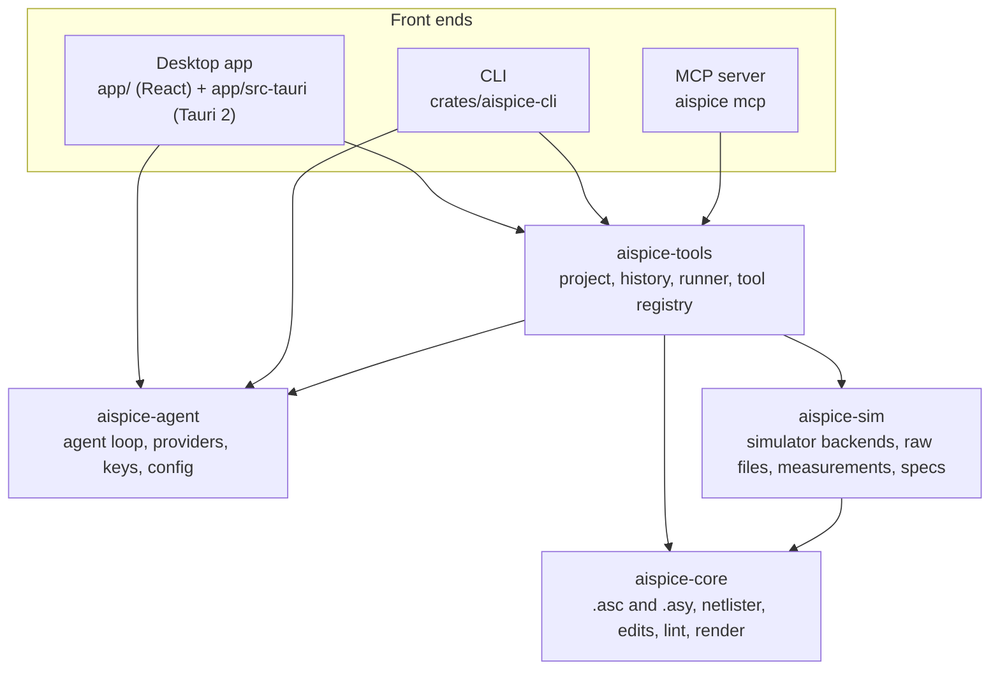

# Architecture

aispice is a Rust workspace with one engine and three front ends. The desktop app, the command line and the MCP server all call the same tool registry, so a tool behaves the same everywhere and is tested once.

## Crates

### aispice-core

Pure computation over files: no processes and no network.

| Module | What it does |
|---|---|
| `encoding` | Reads and writes LTspice's encodings (Latin-1, UTF-8, UTF-16LE with or without a byte order mark) and keeps the original on save |
| `schematic` | Lossless `.asc` parser and writer. A file that is read and written unchanged comes back byte for byte |
| `symbol` | `.asy` parser, a built-in library of the common parts, and lookup through the project folder, extra folders and an LTspice installation |
| `geometry` | Grid points, LTspice's rotate-then-mirror orientations, segment indexing for connectivity |
| `netlist` | Schematic to SPICE netlist, following LTspice's own netlister: net naming, pin order, model cards, hierarchy. `policy` checks every netlist before a simulator sees it |
| `edit` | Typed edit operations (add, remove, move, rotate, set value or attribute, connect pins, label nets, directives) with automatic placement and wire routing |
| `lint` | Rule checks: missing or duplicate names, pins that connect to nothing, dangling wire ends, nets that reach only one pin |
| `summary`, `diff` | What the agent reads: parts with the net on every pin, and a semantic diff after an edit |
| `render` | SVG and PNG drawings of schematics |

The netlister is checked against LTspice itself: `crates/aispice-sim/tests/golden_netlist.rs` compares aispice's netlist with LTspice's `-netlist` output for every test schematic, and a larger corpus run matched 660 of 660 files.

### aispice-sim

Running simulators and reading what they return.

| Module | What it does |
|---|---|
| `backend` | ngspice, Xyce, LTspice (native or under Wine) and Spectre (over SSH). Each run is an argument vector in a private temporary folder, with a timeout and capped output |
| `dialect` | Translates the LTspice-flavoured netlist for the simulator in use |
| `raw`, `log`, `dataset` | Binary and ASCII raw files, logs and `.meas` results, as one dataset type |
| `expr` | Expressions over vectors (`V(out)/V(in)`, `db()`, `ph()`) |
| `measure` | Named measurements: values, extremes, rise and fall time, overshoot, settling, crossings, gain, bandwidth, unity-gain frequency, phase and gain margin |
| `spec` | Spec tables: a measurement plus limits, evaluated to pass or fail with a margin |
| `sweep`, `montecarlo`, `optimize` | Parameter sweeps, tolerance analysis with yield, and sizing parameters within bounds to meet specs |
| `plot` | SVG plots of waveforms |

### aispice-agent

The language model side. It knows nothing about circuits.

| Module | What it does |
|---|---|
| `provider` | Streaming clients for Anthropic's Messages API and OpenAI-compatible APIs (OpenAI, Gemini, OpenRouter, Ollama, custom endpoints), mapped onto one message type. Retries, size limits, and redaction of keys in errors |
| `agent` | The tool calling loop: stream a reply, run the tools it asks for, feed the results back, stop at a step limit or when cancelled |
| `tool` | The `Tool` trait and the registry, shared by the agent and the MCP server |
| `keys` | API keys in the OS keychain, with a private file as fallback and environment variables first |
| `config` | `config.toml` |
| `testing` | A scripted provider for tests |

### aispice-tools

Where circuits meet the agent.

| Module | What it does |
|---|---|
| `project` | The open folder. Every path is resolved inside it and refused if it escapes, including through symbolic links. Writes are atomic, and every save records a snapshot for undo |
| `runner` | Picks a simulator, netlists the circuit, runs it, keeps recent results |
| `workspace` | What all tools share: the project, the runner, and hooks a front end sets (approve an edit first, reload LTspice after a save) |
| `tools` | The tools themselves. `aispice docs tools` prints the full reference |
| `prompt` | The system prompt |
| `setup` | Builds a workspace and runner from the config file |

### aispice (CLI)

`crates/aispice-cli`, the `aispice` binary: `chat`, `sim`, `check`, `netlist`, `lint`, `show`, `render`, `mcp`, `doctor`, `keys`, `models` and `docs`. The MCP server uses the `rmcp` crate over stdio.

### Desktop app

`app/` is a React interface built with Vite; `app/src-tauri` is the Tauri 2 shell. The shell has no circuit logic of its own: its commands call `aispice-tools`, and the agent streams events to the interface over a Tauri channel. The interface types in `app/src/ipc/types.ts` are the contract between the two. `app/src/ipc/mock.ts` implements the same contract in the browser, which is what the interface tests and screenshots run against.

## How a request flows

1. The user asks for a change in chat. The front end builds the system prompt (project, open circuit, simulators found) and starts the agent with the tool registry.
2. The model reads the circuit with `read_schematic`, which returns parts, the net on each pin and the directives, so it never has to reason about coordinates.
3. It calls `edit_schematic` with typed operations such as "set R1 to 2.2k" or "connect R2.A to out". aispice places parts on the grid and routes wires, recomputing connectivity for every candidate route so a wire joins only the pins it was asked to join.
4. If the user chose "ask before applying", the front end shows the diff and waits. Otherwise the edit is saved at once, with a snapshot for undo, and LTspice is shown the new file.
5. The model proves the change with `simulate`, `measure` and `check_specs`, and can size parts with `optimize` or check robustness with `monte_carlo`.
6. Every tool returns text for the model and structured data for the interface (diffs, waveforms, spec tables), which the chat shows as cards.

## Security model

Circuit files, simulator logs and tool output are data, not instructions. The design limits what any of them can do:

- **Confinement.** Tools work inside the project folder. Paths are canonicalised and anything outside the folder, or inside `.aispice/`, is refused.
- **No shell.** Every process is started with an argument vector. The one remote shell command, for Spectre, is built from the user's configuration and values aispice generated and checked.
- **Netlist policy.** Before a simulator runs, the netlist and everything it includes are checked against an allowlist of dot-commands. Control blocks, shell escapes, and includes outside the project are refused.
- **Approval.** Every tool that writes goes through one approval hook, so "ask before applying" covers edits, spec files, optimiser results and undo.
- **Keys.** API keys stay in the keychain and are never logged, printed or included in errors.
- **Desktop.** A strict content security policy, minimal Tauri capabilities, and SVG sanitising in the interface. Chat sessions are stored in the user's data folder, never in a project, so a cloned repository cannot plant a conversation.

See [SECURITY.md](../SECURITY.md) to report a problem.

## Tests

| Layer | Where |
|---|---|
| Unit and golden tests | `cargo test --workspace`, beside each module and in each crate's `tests/` |
| Netlists against LTspice | `crates/aispice-sim/tests/golden_netlist.rs` (live with `AISPICE_LTSPICE_TESTS=1`) |
| Simulators | `crates/aispice-sim/tests/`, on ngspice in CI and on Xyce and LTspice locally when installed |
| Agent and tools | `crates/aispice-tools/tests/`, with the scripted provider driving the real tools |
| MCP | `crates/aispice-cli/tests/mcp.rs`, a real client over stdio |
| Interface | `npm test -w app` (Vitest) and `npx playwright test` in `app/` against the browser mock |
| Desktop app | `npm run test:desktop -w app`: the built app driven through tauri-driver and WebKitWebDriver, with a local mock model |
